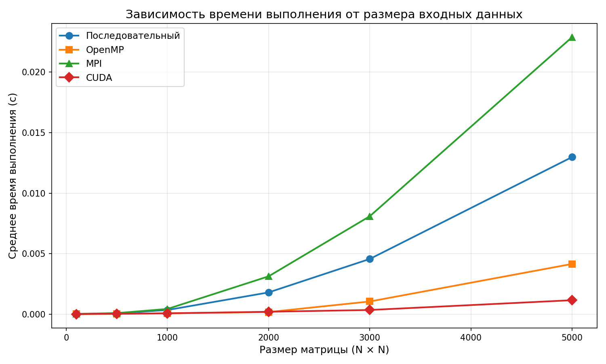
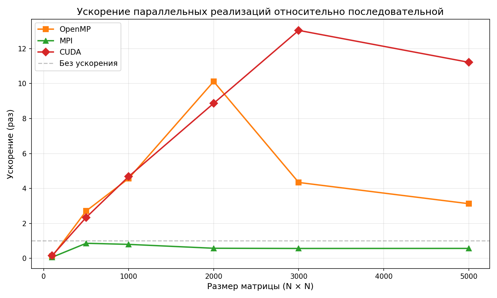

# parallel-compute
## Сравнительный анализ производительности параллельных вычислительных систем: OpenMP, MPI, CUDA

**Задача:** Определить строку с максимальной суммой элементов

---

## Оглавление

1. [Цель работы](#1-цель-работы)
2. [Задачи](#2-задачи)
3. [Постановка задачи](#3-постановка-задачи)
4. [Описание алгоритма](#4-описание-алгоритма)
5. [Создание приложения](#5-создание-приложения)
6. [Вычислительный эксперимент](#6-вычислительный-эксперимент)
7. [Выводы](#7-выводы)
8. [Список источников](#8-список-источников)
9. [Приложения](#9-приложения)

---

## 1. Цель работы

Целью лабораторной работы является анализ и сравнение производительности (скорости вычислений) на графических процессорах NVIDIA (GPU) с последовательными и другими параллельными вычислительными системами (OpenMP, MPI).

---

## 2. Задачи

1. Реализовать последовательный алгоритм поиска строки с максимальной суммой элементов матрицы.
2. Реализовать параллельный алгоритм с использованием технологии OpenMP (общая память).
3. Реализовать параллельный алгоритм с использованием MPI (распределённая память).
4. Реализовать параллельный алгоритм для вычислений на GPU NVIDIA (CUDA).
5. Провести вычислительный эксперимент для каждой реализации:
   - определить среднее время фактического выполнения программы;
   - построить графики зависимости времени выполнения от размера входных данных.
6. Провести сравнительный анализ результатов вычислительных экспериментов.

---

## 3. Постановка задачи

**Дано:** прямоугольная матрица **A** размером N × M, элементы которой — вещественные числа.

**Требуется:** найти строку с максимальной суммой элементов, то есть определить индекс i* такой, что:

$$i^* = \arg\max_{0 \le i < N} \sum_{j=0}^{M-1} A_{ij}$$

**Математическая формализация.** Обозначим сумму элементов i-й строки:

$$S_i = \sum_{j=0}^{M-1} A_{ij}, \quad i = 0, 1, \ldots, N-1$$

Тогда искомый результат: индекс строки i* = arg max S_i и соответствующее значение S_{i*}.

**Область применения задачи:**
- Анализ данных: поиск наиболее «нагруженной» строки в матрице наблюдений.
- Линейная алгебра: оценка строчных норм матриц.
- Обработка изображений: поиск строки с максимальной яркостью.
- Финансовый анализ: нахождение периода с максимальным суммарным доходом по портфелю активов.

Алгоритмическая сложность последовательного решения составляет **O(N × M)** по времени и **O(1)** дополнительной памяти.

---

## 4. Описание алгоритма

### 4.1 Последовательный алгоритм

```
Вход: матрица A[N][M]
Выход: индекс строки max_row, значение max_sum

max_sum = Σ A[0][j] для j = 0..M-1
max_row = 0
для i = 1 до N-1:
    S = Σ A[i][j] для j = 0..M-1
    если S > max_sum:
        max_sum = S
        max_row = i
вернуть (max_row, max_sum)
```

### 4.2 Параллельный алгоритм (OpenMP)

Строки матрицы распределяются между потоками статически (`schedule(static)`). Каждый поток находит локальный максимум среди своего диапазона строк. Затем через критическую секцию (`#pragma omp critical`) вычисляется глобальный максимум.

```
Каждый поток t получает диапазон строк [i_start, i_end):
    local_max_sum = −∞
    для i в [i_start, i_end):
        S = Σ A[i][j]
        если S > local_max_sum:
            local_max_sum = S;  local_max_row = i
    critical section:
        если local_max_sum > global_max_sum:
            global_max_sum = local_max_sum;  global_max_row = local_max_row
```

### 4.3 Параллельный алгоритм (MPI)

1. Процесс 0 генерирует матрицу и рассылает блоки строк всем процессам с помощью `MPI_Scatterv` (с учётом неравномерного деления N на число процессов).
2. Каждый процесс вычисляет суммы своих строк и находит локальную строку-максимум.
3. Глобальная редукция выполняется через `MPI_Allreduce` с операцией `MPI_MAXLOC` для пары `(значение, глобальный_индекс_строки)`.

```
Процесс p получает строки [offset_p, offset_p + local_rows_p):
    local_max = {−∞, 0}
    для i = 0..local_rows_p-1:
        S = Σ local_A[i][j]
        если S > local_max.val:
            local_max = {S, offset_p + i}
MPI_Allreduce(local_max → global_max, MPI_DOUBLE_INT, MPI_MAXLOC)
```

### 4.4 Параллельный алгоритм (CUDA)

Вычисление выполняется в два этапа двумя ядрами GPU:

1. **`row_sums_kernel`** — каждый CUDA-поток вычисляет сумму одной строки:
   ```
   row = blockIdx.x * blockDim.x + threadIdx.x
   sums[row] = Σ matrix[row][j]  для j = 0..M-1
   ```

2. **`reduce_max_kernel`** — параллельная блочная редукция в разделяемой памяти (`__shared__`) для нахождения индекса максимального элемента вектора `sums`. Редукция выполняется по схеме «бабочки» (half-step reduction). Финальный максимум по результатам блоков находится на CPU.

```
Шаг 1 (GPU): sums[i] = Σ_j A[i][j]         // N потоков параллельно
Шаг 2 (GPU): блочная редукция max(sums)      // blockDim = 256
Шаг 3 (CPU): финальный поиск max среди блоков
```

---

## 5. Создание приложения

### 5.1 Аппаратная часть

| Компонент | Характеристика |
|-----------|----------------|
| **CPU** | Intel Core i7-14700KF (20 ядер / 28 потоков, базовая частота 3,4 ГГц) |
| **ОЗУ** | 32 ГБ DDR5 |
| **GPU** | NVIDIA GeForce RTX 4060, 8 ГБ GDDR6, 3072 CUDA-ядра, SM 8.9 |
| **ОС** | Windows 11 Pro (10.0.26200) |
| **Накопитель** | NVMe SSD |

### 5.2 Программное обеспечение

| Компонент | Версия / Описание |
|-----------|-------------------|
| **Компилятор** | GCC (MinGW-w64) с флагами `-O2 -fopenmp` |
| **MPI** | Microsoft MPI (msmpi) |
| **CUDA Toolkit** | NVIDIA CUDA 12.x, nvcc |
| **Python** | 3.x, библиотеки `matplotlib`, `subprocess` |
| **Сборка** | GNU Make |

### 5.3 Сборка и запуск

```bash
make            # сборка всех четырёх бинарных файлов

./sequential 1000 1000 5000
./openmp_ver 1000 1000 5000
mpirun -np 4 ./mpi_ver 1000 1000 5000
./cuda_ver 1000 1000 5000
```

### 5.4 Корректность работы

Все четыре реализации используют одну и ту же матрицу, заполненную псевдослучайными числами с фиксированным начальным значением (`seed = 42`). Элементы матрицы равномерно распределены на интервале [−100, 100]. Это гарантирует воспроизводимость и позволяет сравнивать результаты (строка-максимум и её сумма) между всеми реализациями.

Пример вывода для матрицы 1000 × 1000:

```
=== Последовательный алгоритм ===
Размер матрицы: 1000 x 1000
Строка с макс. суммой: 42 (сумма = 3247.81)
Кол-во итераций (k): 5000
Среднее время: 0.000346468 с
RESULT:42:3247.81:0.000346468

=== OpenMP алгоритм ===
Потоков: 28
RESULT:42:3247.81:0.000075794

=== CUDA алгоритм ===
RESULT:42:3247.81:0.000074018
```

Строка-максимум и её сумма совпадают во всех реализациях, что подтверждает корректность вычислений.

---

## 6. Вычислительный эксперимент

### 6.1 Средства измерения времени

| Реализация | Метод измерения |
|------------|-----------------|
| Последовательная | `clock_gettime(CLOCK_MONOTONIC)` — монотонные часы высокого разрешения POSIX |
| OpenMP | `clock_gettime(CLOCK_MONOTONIC)` — аналогично последовательной |
| MPI | `MPI_Wtime()` — стандартный таймер MPI с барьерной синхронизацией |
| CUDA | `cudaEvent` — аппаратные события GPU, разрешение ~0.5 мкс |

Среднее время вычисляется как:

$$T_{ср} = \frac{1}{k} \sum_{i=1}^{k} T_i$$

где k — количество повторений (от 100 при N=5000 до 100 000 при N=100).

### 6.2 Условия эксперимента

- Матрицы квадратные: N × N (N = M).
- Значения N: 100, 500, 1000, 2000, 3000, 5000.
- MPI-эксперимент: 4 процесса (`mpirun -np 4`).
- OpenMP-эксперимент: количество потоков по умолчанию = `omp_get_max_threads()` = 28.
- CUDA: размер блока — 256 потоков.

### 6.3 Таблица средних времён выполнения

**Таблица 1.** Среднее время выполнения одной итерации (секунды)

| N (строк) | Последовательная | OpenMP (28 пот.) | MPI (4 проц.) | CUDA |
|:---------:|:----------------:|:----------------:|:-------------:|:----:|
| 100 | 0.0000018 | 0.0000168 | 0.0000288 | 0.0000115 |
| 500 | 0.0000792 | 0.0000292 | 0.0000921 | 0.0000339 |
| 1000 | 0.000346 | 0.0000758 | 0.000434 | 0.0000740 |
| 2000 | 0.001800 | 0.000178 | 0.003129 | 0.000203 |
| 3000 | 0.004564 | 0.001051 | 0.008094 | 0.000350 |
| 5000 | 0.012984 | 0.004154 | 0.022893 | 0.001157 |

### 6.4 Таблица ускорения

Ускорение рассчитывается как отношение времени последовательного алгоритма к времени параллельного:

$$S = \frac{T_{seq}}{T_{par}}$$

**Таблица 2.** Ускорение параллельных реализаций относительно последовательной

| N | OpenMP | MPI | CUDA |
|:-:|:------:|:---:|:----:|
| 100 | 0.11× | 0.06× | 0.16× |
| 500 | 2.71× | 0.86× | 2.34× |
| 1000 | 4.57× | 0.80× | 4.68× |
| 2000 | **10.12×** | 0.58× | 8.87× |
| 3000 | 4.34× | 0.56× | 13.04× |
| 5000 | 3.13× | 0.57× | **11.22×** |

### 6.5 Графики

**График 1.** Зависимость среднего времени выполнения от размера матрицы



**График 2.** Ускорение параллельных реализаций относительно последовательной



### 6.6 Анализ результатов

**Последовательная реализация** демонстрирует линейный рост времени с увеличением числа элементов матрицы (O(N²) для квадратных матриц), что соответствует теоретической оценке алгоритмической сложности.

**OpenMP.** При малых размерах (N = 100) параллельная версия значительно медленнее последовательной: накладные расходы на создание пула потоков (28 потоков) превышают выгоду от параллелизма. При N = 2000 достигается максимальное ускорение ~10×. При N ≥ 3000 ускорение снижается до 3–4×, что объясняется ростом объёма данных, превышающих размер кэша L3, и возникновением эффектов NUMA в гибридной архитектуре i7-14700KF (P-ядра + E-ядра с разными задержками доступа к памяти).

**MPI.** Версия на базе MPI показывает производительность ниже последовательной для всех исследованных размеров. Причина — преобладание накладных расходов на межпроцессное взаимодействие: `MPI_Scatterv` копирует весь буфер матрицы на каждой итерации, а 4 процесса MPI работают на одной машине через разделяемую память, не получая преимуществ распределённой архитектуры. При увеличении N относительный проигрыш стабилизируется на уровне ~0.57× (коммуникационные накладные расходы не исчезают).

**CUDA.** GPU-реализация показывает наилучшую масштабируемость при больших матрицах. При N = 3000 достигается ускорение 13×, при N = 5000 — 11.2×. При малых N (= 100) CUDA также проигрывает: время передачи данных на GPU и запуск ядер доминируют. Начиная с N ≈ 500 GPU начинает выигрывать у последовательной реализации, а при N ≥ 3000 — демонстрирует наилучшую абсолютную производительность среди всех реализаций.

---

## 7. Выводы

1. **Задача поиска строки с максимальной суммой** допускает эффективное распараллеливание: вычисление сумм строк — независимые операции, хорошо распределяемые между потоками/процессами/ядрами GPU.

2. **OpenMP** эффективен при средних размерах данных (N ≈ 2000), достигая ускорения ~10× на 28 потоках. Однако при больших матрицах производительность снижается из-за деградации кэша и неоднородности памяти в гибридной архитектуре процессора.

3. **MPI** на единственной машине нецелесообразен для данной задачи: коммуникационные накладные расходы (`MPI_Scatterv` на каждой итерации) полностью нивелируют выигрыш от параллелизма. MPI даёт преимущество при распределённых вычислениях на кластере с большими матрицами, где передача данных выполняется однократно.

4. **CUDA** демонстрирует наибольшее ускорение при больших входных данных (N ≥ 3000): до 13× по сравнению с последовательной реализацией. Массовый параллелизм GPU (3072 CUDA-ядра) оптимально подходит для задач с высокой степенью независимых вычислений и регулярным доступом к памяти.

5. **Порог эффективности**: все параллельные реализации проигрывают последовательной при N ≤ 100 из-за накладных расходов на инициализацию. Начиная с N = 500 OpenMP и CUDA начинают выигрывать.

6. **Рекомендация**: для вычислений на одной машине с большими матрицами — CUDA; для средних размеров — OpenMP; MPI целесообразен только в кластерной конфигурации.

---
